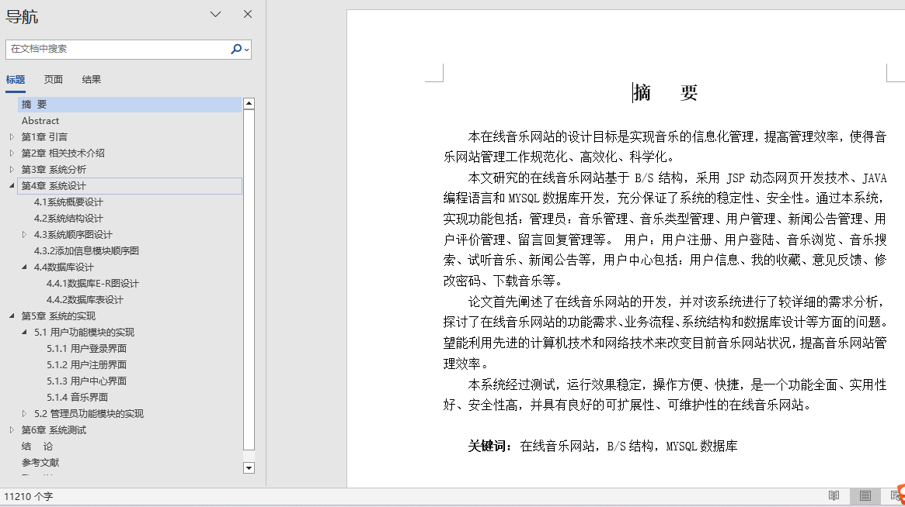
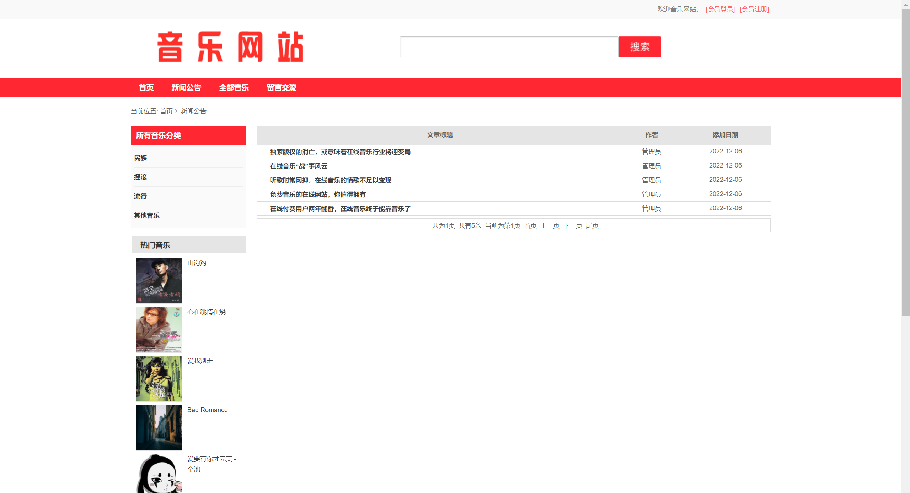
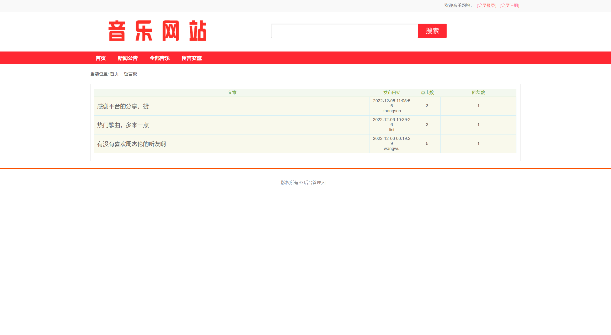
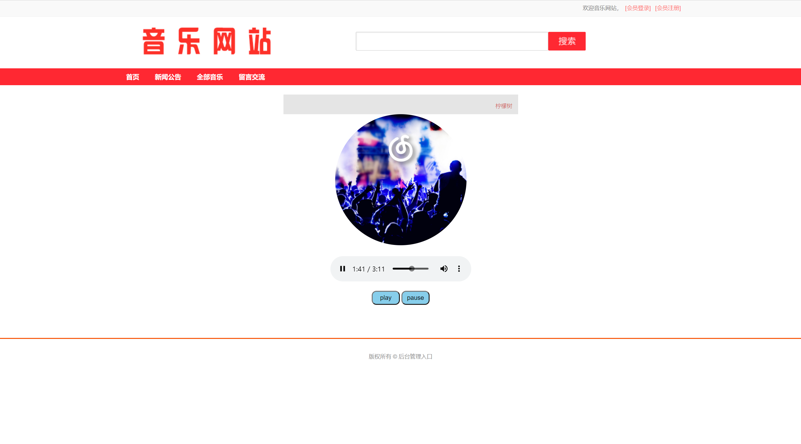
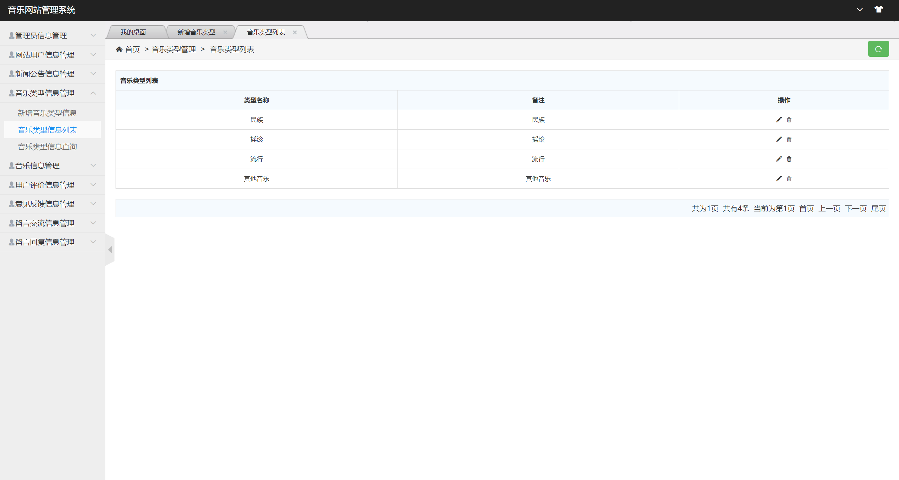
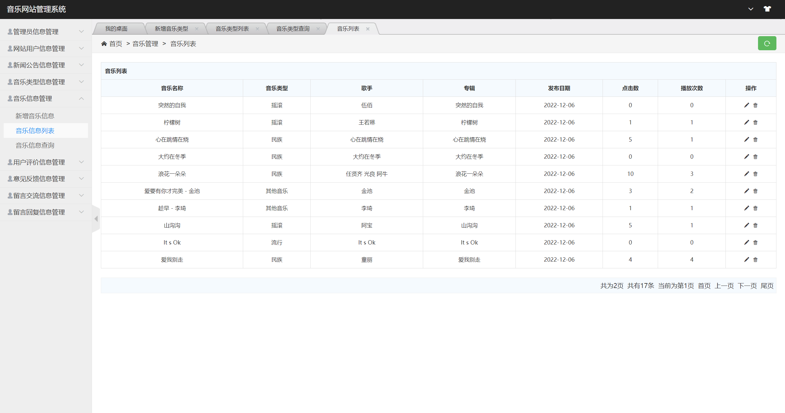
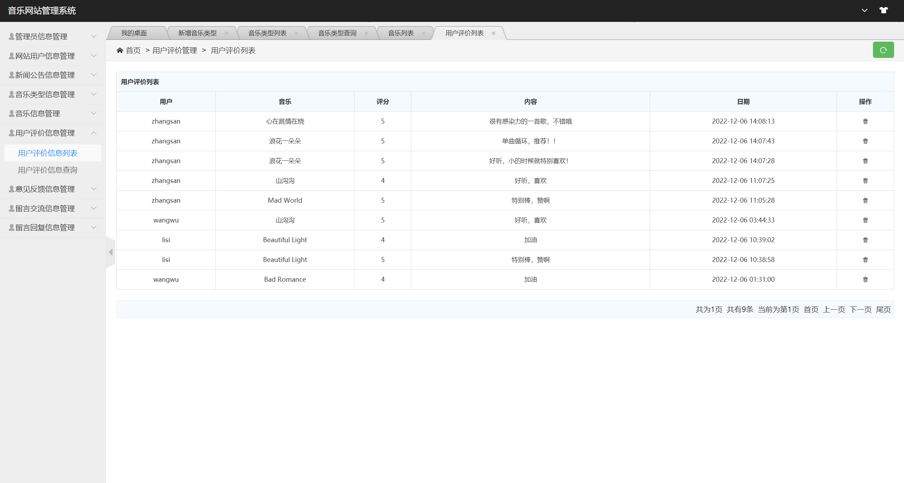
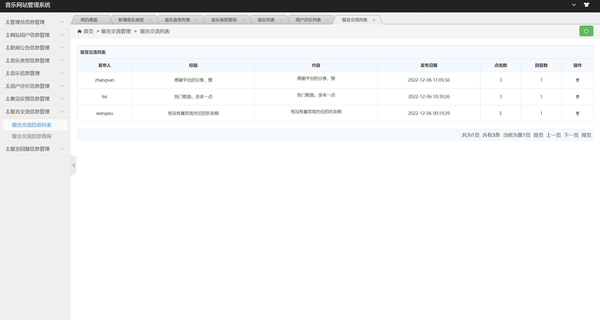

## 基于SSM实现的在线音乐网站(程序+报告)

###  获取sql数据库文件: 从戎源码网 (https://armycodes.com/) QQ: 386869957 QQ群: 377586148
###  所有系统地址: (https://github.com/YuLin-Coder/AllProjectCatalog) 
###  所有项目以及源代码本人均调试运行无问题 可支持远程安装部署调试、定制修改、代码讲解

## 项目介绍
基于SSM实现的在线音乐网站，该系统主要分为前台和后台两大功能模块，共包含两个角色：用户、管理员。
具体的系统功能如下：
1.前台功能
前台首页、音乐浏览、音乐搜索、音乐分类查找、音乐详情、音乐播放、音乐下载、添加收藏、新闻公告、留言交流、用户注册、用户登陆、个人中心、用户信息修改、我的收藏、意见反馈、修改密码等功能。
2.后台功能
后台系统登陆、管理员管理、用户信息管理、音乐管理、音乐类型管理、新闻公告管理、用户评价管理、意见反馈管理、留言交流管理、消息回复管理等功能。

## 项目技术
- 编程语言：Java
- 数据库：MySQL
- 前端技术：JSP、jQuery 、H-ui
- 后端技术：Spring、SpringMVC、MyBatis

## 运行环境
- JDK版本：JDK1.8及以上
- 开发工具：IDEA、Ecplise、Myecplise都可以
- 数据库: MySQL5.7及以上

## 运行截图

